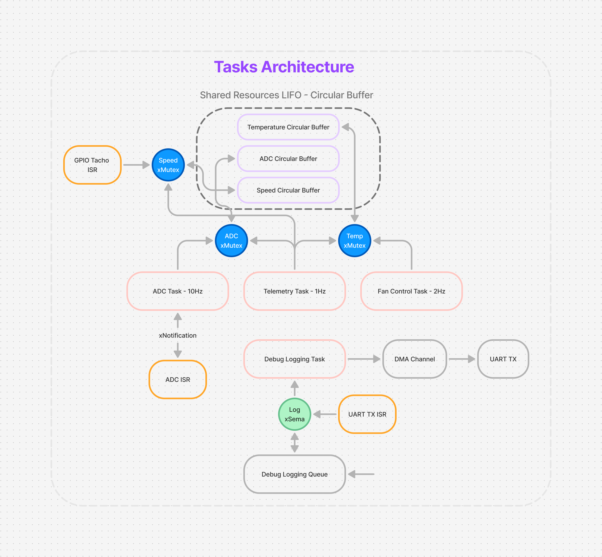
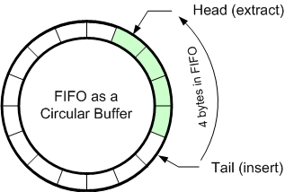
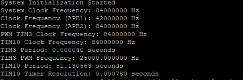
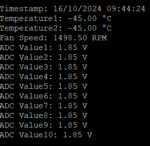
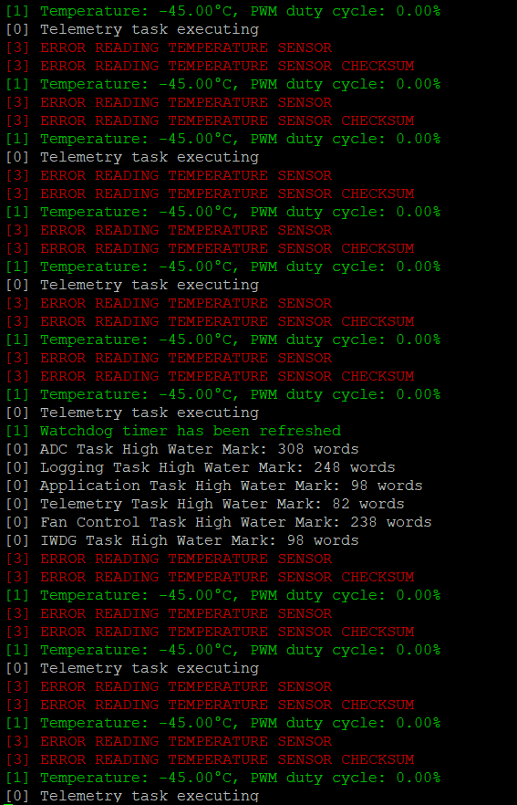

# Firmware Overview

This firmware is designed with a variety of techniques for task communication, resource sharing, and peripheral control, while ensuring high performance. Below are key components and methodologies used:

## Architecture & Task Management
- **FreeRTOS Kernel (v202406.01-LTS)**: was ported directly, without relying on the CMSIS layer, to maintain an architecture-agnostic design. This approach ensures flexibility across different hardware platforms.
- **Task Communication & Synchronization**: Mutexes, semaphores, and direct notifications were used for efficient task/ISR synchronization.
- **Polling, Interrupts, and DMA**: Implemented a blend of these mechanisms to balance performance with simplicity depending on the peripheral.
- **Shared Resource Management**: A circular buffer of LIFO type was used to synchronize and serialize data access between tasks and ISRs.

<div align="center">
    
    <br>
    
</div>

## Temperature Sensor
- The temperature sensor returns two bytes of temperature data followed by a third byte for CRC.
- **CRC Check**: Implemented to ensure data integrity. If the CRC is invalid, a value of 0 is returned for the ticks which resluts in a -45 °C temperature. Error handling could be enhanced as this was implemented without access to hardware, but this should be sufficient since failure in reading temperature will cause the fan to stop.

## Fan Control (PWM & Tachometer)
- **System Clock**: Set to run at 84 MHz, with no power-saving logic since power consumption wasn’t a requirement.
- **PWM Control**:
  - Configured using TIM3 CH1 with a frequency of 25kHz.
  - Duty cycle adjusted dynamically based on the temperature.
- **Tachometer Feedback**:
  - An interrupt pin with TIM10 is configured to measure the fan's speed.
  - The timer has a resolution of 0.78ms with a period of roughly 52s and can measure speed as low as 2-3Hz (~50-90RPM) without wrapping and up to 1kHz+.
### Overflow Detection Mechanism
- An overflow detection mechanism has been implemented to accurately measure lower fan speeds. However, the width of the data stored in the circular buffer is currently set to 16-bit. This decision was made to use the circular buffer as a centralized utility across multiple system components and to reduce overall memory consumption.
- **Low-Speed Accuracy Consideration**: If accurate measurement of very low speeds is critical, the period value in the ISR should be changed to 32-bit, and the typecast should be removed. 
```c
period = (uint16_t)tempPeriod;
```
Additionally, the buffer width should be increased from 16-bit to 32-bit to handle larger values and ensure precision.
- **Averaging Speed Samples**: An average of 3 speed samples is used to mitigate the effect of outliers, ensuring a more stable and reliable speed measurement.

- **Control Algorithm**: Could be improved with the tachometer signal as a closed-loop feedback.

<div align="center">
    
</div>

## ADC Readings
- **Interrupt-Based ADC Conversion**: The ADC readings are handled through an interrupt-driven approach to ensure non-blocking and efficient conversion.
- **Synchronization**: A notification and mutex mechanism is used for task synchronization, ensuring that ADC data is processed reliably without race conditions or data corruption.

## RTC Timer
- **LSE Clock**: The RTC uses the Low-Speed External (LSE) clock to ensure accurate timestamping.
- **Initial Timestamp**: The starting timestamp is hardcoded to `16/10/2024 09:00:00` and there is no configuration option provided for altering this initial value.

## Information Messages
- **USB VCP**: All information messages are directed to the USB Virtual COM Port (VCP) at a baud rate of 115200.
<div align="center">
    
</div>


## Watchdog Timer
- **Implemented Watchdog**: Not explicitly required by the project but considered a good design practice. Ensures the system resets if a task fails to refresh the watchdog in time.
- **Timeout**: Configured with a 32-second timeout, with a dedicated task refreshing the watchdog every 10 seconds.

## UART & Logging
- **UART Communication**: Set up at 115200 baud rate.
- **Logging**:
  - **DMA-Based Logging**: Log messages are transmitted via DMA to minimize CPU load.
  - **Queue**: Logs are enqueued and handled by a low-priority task, ensuring minimal CPU engagement.
  - **Binary Semaphore**: Used for synchronization, triggered by DMA/UART ISR to avoid buffer overwrite.

### Log Levels
Defined in `logging.h`:
```c
typedef enum {
    LOG_DEBUG,
    LOG_INFO,
    LOG_WARNING,
    LOG_ERROR,
    LOG_CRITICAL
} LogLevel;
```
### Color Codes
The logging system uses ANSI escape codes to display log messages in different colors, supported by most modern terminals.

- **LOG_DEBUG**: No color (default console text color).
- **LOG_INFO**: Green (`\033[32m`)
- **LOG_WARNING**: Yellow (`\033[33m`)
- **LOG_ERROR**: Red (`\033[31m`)
- **LOG_CRITICAL**: Red background (`\033[41m`)

> **Note**: Color-coded logs are supported in terminals with ANSI color support (e.g., Linux terminal, macOS terminal, and most Windows terminal emulators like Git Bash and Windows Terminal). On unsupported terminals, escape codes will be printed as part of the log message.

### Default Log Level
The default log level is configurable via the following macro:
```c
#define DEFAULT_LOG_LEVEL LOG_DEBUG
```
### Logging Control
The log messages are Enabled or disabled using the ENABLE_LOGGING macro in logging.h:
```c
#define ENABLE_LOGGING
#ifdef ENABLE_LOGGING
    #define LOG(level, format, ...) logMessage(level, format, ##__VA_ARGS__)
#else
    #define LOG(level, format, ...)
#endif
```
<div align="center">
    
</div>

